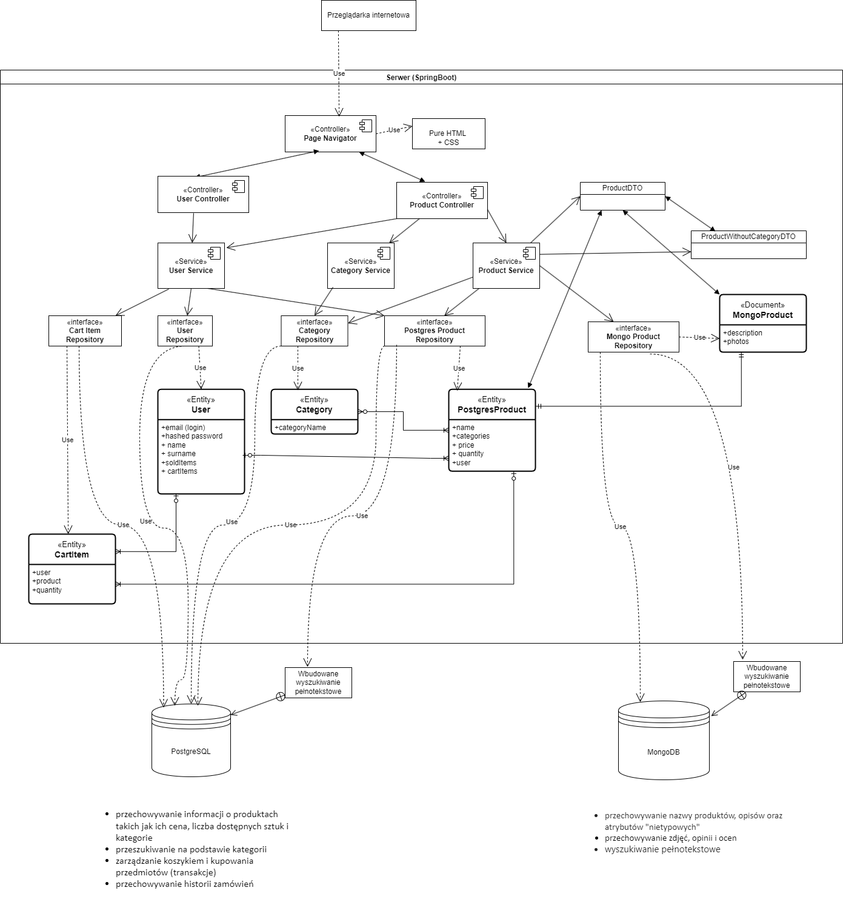

# pis-allegro
System działający na podobnej zasadzie jak Allegro.

## Wybrane technologie:
- **język**: Java + Spring
- **automatyzacja budowy projektu**: Maven
- **repozytorium kodu**: GitHub
- **repozytorium mavenowe**: Nexus
- **serwer CI**: Jenkins
- **IDE**: Intellij IDEA
- **issues**: Jira
- **testy**: JUnit
- **narzędzie do mierzenia pokrycia kodu testami**: JaCoCo

## Architektura

## Przypadki użycia

- Użytkownik chce zacząć sprzedawać rzeczy w serwisie
  1. Użytkownik rejestruje się podając właśniwe dane
  2. Użytkownik tworzy nowe ogłoszenie
  3. Użytkownik dodaje tytuł, opis, cenę i opcjonalnie zdjęcie do ogłoszenia
  4. Użytkownik tworzy ogłoszenie
  5. Użytkownik znajduje ogłoszenie na swojej tablicy ogłoszeń
  - Alternatywne scenariusze
    - Jeżeli pominie wprowadzenie któregoś z obowiązkowych elementów ogłoszenia (tytuł, opis, cena), to ogłoszenie nie zostaje utworzone i użytkownik musi uzupełnić właściwy element
- Użytkownik (kupujący) chce kupić produkt
  1. Kupujący loguje się na swoje konto
  2. Kupujący wyszukuje produkt w wyszukiwarce
  3. Kupujący wybiera szukany produkt z wyświetlonej listy
  4. Kupujący wybiera kupno produktu
  5. Kupujący wybiera sposób dostawy
  6. Kupujący wprowadza dane do przelewu w odpowiednim oknie
  7. Kupujący widzi kupiony przedmiot w swoim inwentarzu
  8. Sprzedawca dostaje inforamcje o sprzedaży przedmiotu i adresie wysyłki
  9. Sprzedawca dostaje pieniądze za sprzedaż
  10. Sprzedawca wysyła przedmiot pod wskazany adres
    - Alternatywne scenariusze
      - Jeżeli przelew się nie powiódł, to użytkownik ponawia operacje od punktu 3
      - Jeżeli przedmiot po dostarczeniu do kupującego okazuje się uszkodzony to kupujący odsyła przedmiot sprzedawcy, a sprzedawca zwraca pieniądze
- Użytkownik chce zedytować produkt
  1. Użytkownik loguje się na swoje konto
  2. Użytkownik otwiera swoją tablicę ogłoszeń
  3. Użytkownik wybiera dany produkt
  4. Użytkownik zmienia dane produktu
  5. Użytkownik zapisuje produkt
  - Alternatywne scenariusze
    - Jeżeli użytkownik pominie wprowadzenie któreś z obowiązkowych elementów ogłoszenia (tytuł, opis, cena), to ogłoszenie nie zostaje nadpisane i użytkownik musi uzupełnić właściwy element

## Wymagania niefunkcjonalne

## Uzasadnienie wyboru baz danych
### MongoDB  
**Model danych**:  
  - MongoDB przechowuje dane w postaci dokumentów podobnych do JSON, co zapewnia **dużą elastyczność** i **szybki czas rozwoju**.
  - Możliwość zgrupowania (podzielenia danych na **kolekcje**) obiektów różniącyh się strukturą. Jest to ważne z punktu widzenia naszego serwisu, gdyż produkty podobnego przeznaczenia mogą bardzo się od siebie różnić (np. zabawki).  
**Obsługa dużej ilości danych**:  
  - MongoDB wykorzystuje **architekturę rozproszoną** co jest korzystne zarówno ze względu na **skalowalność w poziomie**, jak i zapewnienie dużej **niezawodności**.
  - MongoDB może **równocześnie obsługiwać wiele zapytań**, co zapewni **dużą wydajność** w przypadku korzystania z serwisu przez wielu użytkowników.  
**Indeksowanie**:  
  - MongoDB pozwala na założenie wielu różnych indeksów. Pozwala to na zorientowanie bazy na zapytania najczęściej wykonywane, a tym samym umożliwia zapewnienie dużej wydajności.
  - MongoDB pozwala na założenie indeksów tekstowych, co może okazać się bardzo użyteczne podczas impolementacji przeszukiwania pełnotekstowego.  
**Wysoka dostępność**:  
  - MongoDB zapewnia replikację danych w ramach zestawu replik. Pozwala to na dostęp do przynajmniej części danych nawet w wyniku awarii. Jest to bardzo dobre rozwiązanie dla naszego serwisu, gdyż w przypadku awarii użytkownicy nadal mogą korzystać z serwisu (ewentualnie w ograniczonym zakresie).  
**Alternatywy dla implementacji operacji atomowych**:  
  - operacje zapisu są atomowe na poziomie dokumentu nawet jeśli zapis modyfikuje wiele zagnieżdżonych dokumentów wewnątrz jednego dokumentu.
  - polecenia modyfikujące pojedyncze dokumenty są atomowe - i to nam wystarczy.
 Może okazać się przydatne przy zapewnianiu spójności między bazami.  
### PostgreSQL
...

### Zapewnienie spójności między bazami danych
Zapewnienie spójności między bazami danych będzie kluczowe tak naprawdę jedynie w sytuacji gdy sprzedawca dodaje lub modyfikuje przedmiot. Wpływa to na zmianę w jednej tabeli w bazie PostgreSQL i jednego dokumentu w bazie MongoDB. Z tego powodu zdecydowaliśmy na użycie transakcji, zakładając, że operacja powinna się udać albo całkowicie, albo nie - na co pozwoli adnotacja `@Transacional` nad odpowiednimi metodami (jest odpowiednia dla MongoDB jeśli edytujemy 1 dokument).   
Źródła: 
- https://www.baeldung.com/spring-data-mongodb-transactions
- https://stackoverflow.com/questions/72677210/spring-boot-postgresql-and-mongodb-data-sync
- https://medium.com/javarevisited/database-isolation-level-with-postgresql-and-spring-boot-c6c2f8fe3b46
Innym problemem może być wyświetlanie produktów jeśli baza mongodb padnie (jeśli coś stanie się z postgresql aplikacja niestety się nie przyda). Wtedy należałoby wyświetlić odpowiedni komunikat o błędzie oraz produkty bez ich zdjęć, ocen czy opisów.
