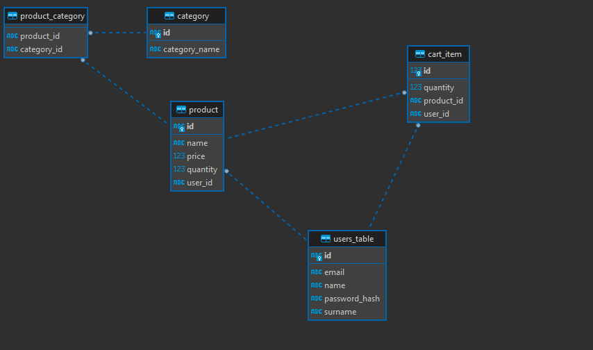

# Dokumentacja i raport z projektu
## Architektura Systemu

## Aspekty techniczne
### Bazy danych
- MongoDB
- PostgreSQL

### Instalacja
Wymagania techniczne:
- Java, wersja >= 17
- Maven
- Zainstalowane i uruchomione obie bazy danych przy czym
  - Postgres w wersji 16.1
  - Mongo w wersji 5
    - Mongo postawione jako zbiór replik (przykładowo `docker run -d -p 27017:27017 --name pis-mongo --network mongoCluster mongo:5 mongod --replSet myReplicaSet --bind_ip localhost,pis-mongo`)
    - Nałożony indeks na kolekcję "product": `db.product.createIndex({ name: "text", description: "text" })`

Instalacja poprzez komendy:
``` bash
mvn install
java -jar target/allegro-0.0.1-SNAPSHOT.jar
```
lub odpowiednio "wyklikując" obie komendy   

## Model bazy danych
PostgreSQL:   

MongoDB:
