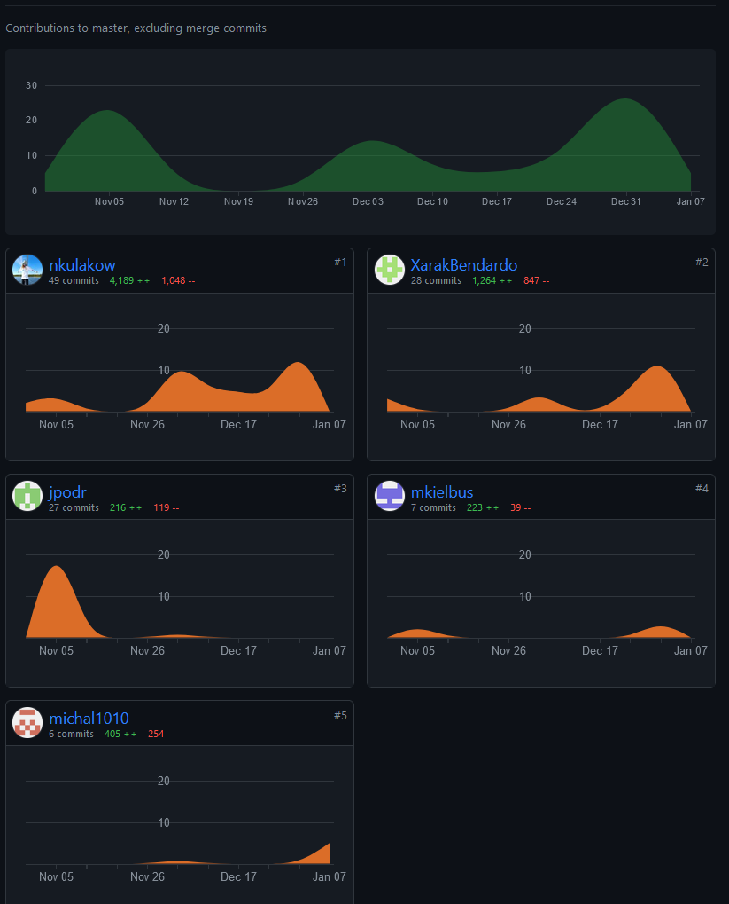

# Dokumentacja i raport z projektu
## Architektura Systemu

## Aspekty techniczne
### Bazy danych
- MongoDB
- PostgreSQL

### Instalacja
Wymagania techniczne:
- Java, wersja >= 17
- Maven
- Zainstalowane i uruchomione obie bazy danych przy czym
  - Postgres w wersji 16.1
  - Mongo w wersji 5
    - Mongo postawione jako zbiór replik (przykładowo `docker run -d -p 27017:27017 --name pis-mongo --network mongoCluster mongo:5 mongod --replSet myReplicaSet --bind_ip localhost,pis-mongo`)
    - Nałożony indeks na kolekcję "product": `db.product.createIndex({ name: "text", description: "text" })`

Instalacja poprzez komendy:
``` bash
mvn install
java -jar target/allegro-0.0.1-SNAPSHOT.jar
```
lub odpowiednio "wyklikując" obie komendy   

### Modele bazy danych
PostgreSQL:   
   

MongoDB:   
   

### Używanie systemu
#### Użytkownik
Jako użytkownik należy wejść na stronę główną i się zalogować (lub zarejestrować i potem zalogować), by przejść do kolejnych stron. Bez logowania można przejść do stron: "adres-pierwszej-strony/view-all-products" oraz "<adres-pierwszej-strony>/fulltext-search". Strona z historią zamówień (Previous buys) nie działa (jest statyczna).   
  
Użytkownik może:
- wyświetlić produktu w danych kategoriach (na stronie: View all products)
- wyszukać produkty po nazwie, opisie oraz nazwach kategorii (na stronie: Search for products)
- wyświetlić szczegóły produktu (na stronie: View details, do której można przejść przyciskając odpowiedni przycisk przy wybranym produkcie na stronach View all products i Search for products)
- zakupić produkty w koszyku (na stronie: Your cart)
- na stronie Manage your products
  - dodać nowe produkty które chce sprzedać
  - wyświetlić dodane produkty (w tym ich aktualną liczbę)
  - edytować dodane produkty
  - każdy produkt może posiadać jedno zdjęcie, musi posiadać nazwę, opis, cenę i ilość oraz należeć do przynajmniej 1 kategorii
- dodać produkty do koszyka (po kliknięciu odpowiedniego przycisku na stronie View details)

#### Administrator 
Administrator może dodać raz wybrane kategorie z pomocą strony "adres-pierwszej-strony/add-some-categories".    

#### Uwagi
Do aplikacji może naraz zalogować się wiele użytkowników w różnych przeglądarkach, ponieważ informacja o tym, kto jest zalogowany (login) przechowywana jest w sesji.   

### Testy
#### Pokrycie
    
Pominięto testowanie funkcji, których nie było sensu testować (@Getters, testy repozytoriów itd.).  
CI zapewniona przez jenkinsa.   

## Raport z pracy
### Podział pracy
- Architektura systemu (w tym zmiany w trakcie) - wszyscy
- Wybór technologii - wszyscy
- Testowanie konfiguracji - wszyscy
- Elementy etapu 3 - Michał Jakomulski i Jakub Podrażka
- Elementy etapu 4:
  - Nel Kułakowska : bazy danych, konfiguracja, szablon, produkty + kategorie + produkty w koszyku (po stronie backendu: serwisy itd.), testy jednostkowe
  - Marcin Wawrzyniak : interfejs graficzny, "implementacja architektury frontendu" (układ kontrolerów i html), Page Navigator, Product Controller
  - Mateusz Kiełbus : użytkownicy (po stronie backendu + user controller), mechanizm sesji

## Commity
     

